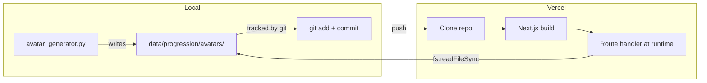

# Advanced Avatar Assets — Full Plan

---

## Advanced Variant Spec (User-Confirmed)

**Advanced = same base sprite, enhanced effects:**

- More glow (brighter highlights, stronger pulse)
- More particles (extra orbiting dots, denser rain, additional energy rings)
- Higher intensity (faster pulse, higher brightness delta)

---

## Production Flow




**No separate CDN upload.** Assets live in `data/progression/avatars/`. Git tracks them. Deploy = commit + push. The route at `/progression/avatars/[[...path]]` serves them at request time.

---

## Execution Diagram

```
Time ──────────────────────────────────────────────────────────────────────────>

Track A (sequential — generator needs transforms first):
  [T1: Advanced transforms] ──────────>
                                 [T2: Extend generator] ──>
                                                          [T3: Run generator] ──>

Track B (parallel with A — different files):
  [T4: Wire home avatar]   ──────────>
  [T5: Wire log avatar]    ──────────>

Track C (after T3 + T4 + T5):
                                                              [T6: Verify local] ──>
                                                              [T7: Verify route] ──>
                                                                                   [T8: Deploy] ──>
```

**Summary:** T1 must finish before T2. T2 must finish before T3. T4 and T5 can run in parallel with A. T6–T8 run after assets exist and wiring is done.

---

## Task Assignments

### T1. Add Advanced Transforms in rpg_sprites.py

**File:** [scripts/rpg_sprites.py](scripts/rpg_sprites.py)

**What to do:**

- For each tier 1–6, add `tierN_idle_advanced(sprite, frame, total)` and `tierN_action_advanced(sprite, frame, total)`
- Pattern: call the base `tierN_idle` / `tierN_action`, then apply enhanced effects:
  - **More glow:** `brighten_part(s, "orb", 40)` or brighten key parts (orb, cursor_block, scroll, aura) by +20–40
  - **More particles:** add extra orbiting dots (tier 2), extra rain columns (tier 1), extra ring segments (tier 3), etc.
  - **Higher intensity:** increase `brightness()` delta, add 1–2 more particle/drop counts
- Add `TIER_ANIMATIONS_ADVANCED: Dict[int, Dict[str, AnimationSpec]]` mirroring `TIER_ANIMATIONS` but using the `*_advanced` transforms
- Add `get_tier_animation(tier, variant='early' | 'advanced')` or a separate `get_tier_animation_advanced(tier)` helper

**Example (tier 1):**

```python
def tier1_idle_advanced(sprite: Sprite, frame: int, total: int = 8) -> Sprite:
    s = tier1_idle(sprite, frame, total)
    s = brighten_part(s, "cursor_block", 30)  # stronger cursor glow
    return s

def tier1_action_advanced(sprite: Sprite, frame: int, total: int = 12) -> Sprite:
    s = tier1_action(sprite, frame, total)
    # Add extra rain column or brighter rain
    p = PALETTES[1]
    # ... extra particles at staff base
    return s
```

**Agent recommendation:** Sonnet — 6 tiers × 2 animations = 12 new functions; needs care with coordinates and palette lookups.

---

### T2. Extend avatar_generator.py for --variant advanced

**File:** [scripts/avatar_generator.py](scripts/avatar_generator.py)

**What to do:**

- Add CLI flag: `--variant` with choices `early`, `advanced`, or `both` (default `early` for backwards compat)
- When `--variant advanced` or `--variant both`: use `get_tier_animation(tier, 'advanced')` (or `TIER_ANIMATIONS_ADVANCED`) for the animation specs
- Output filenames: when advanced, use `-advanced` suffix: `tier-N-idle-advanced.gif`, `tier-N-action-advanced.gif`, `tier-N-static-advanced.png`
- For `--variant both`: run both early and advanced in one pass (or two passes), writing all 36 files (18 early + 18 advanced)
- Ensure default-size outputs (no size suffix) are written for canonical URLs used by rpg.ts

**Agent recommendation:** Fast model — CLI + conditional logic; rpg_sprites API change from T1.

---

### T3. Run Generator to Create Advanced Assets

**Command:** `python3 scripts/avatar_generator.py --variant advanced` (or `--variant both` if early assets need refresh)

**What to do:**

- Run from repo root
- Verify 18 files appear in `data/progression/avatars/`:
  - `tier-{1..6}-idle-advanced.gif`
  - `tier-{1..6}-action-advanced.gif`
  - `tier-{1..6}-static-advanced.png`

**Agent recommendation:** Fast model — single command.

---

### T4. Wire Profile + Avatar to Home Page

**File:** [website/apps/shawnos/app/page.tsx](website/apps/shawnos/app/page.tsx)

**What to do:**

- Import `getRPGProfile` from `@shawnos/shared/lib` (rpg.server), `getAvatarUrlsForProfile` from `rpg`
- Resolve at top of component: `dataRoot = path.join(process.cwd(), '../../../data')`, `profile = getRPGProfile(dataRoot)`, `urls = profile && profile.level > 0 ? getAvatarUrlsForProfile(profile) : null`
- Replace `<AvatarBadge size="compact" />` with `<AvatarBadge size="compact" profile={profile ?? undefined} avatarSrc={urls?.static ?? undefined} avatarIdleSrc={urls?.idle ?? undefined} avatarActionSrc={urls?.action ?? undefined} />`

**Agent recommendation:** Fast model — add resolver block and prop passing.

---

### T5. Wire Profile + Avatar to Log Page

**Files:** [website/apps/shawnos/app/log/page.tsx](website/apps/shawnos/app/log/page.tsx), [website/packages/shared/components/LogHero.tsx](website/packages/shared/components/LogHero.tsx)

**What to do:**

- Same resolver as T4: `dataRoot`, `profile`, `urls`
- LogHero: extend props — add `avatarIdleSrc`, `avatarActionSrc`, `profile`; forward all to AvatarBadge
- In log/page.tsx: pass `profile={profile} avatarSrc={urls?.static} avatarIdleSrc={urls?.idle} avatarActionSrc={urls?.action}` to LogHero

**Agent recommendation:** Fast model — extend LogHero props, wire resolver in log page.

---

### T6. Verify Local Preview

**What to do:**

1. `cd website && npm run dev`
2. Open `http://localhost:3000/rpg-preview`
3. Confirm all 11 tier cards render with images (no broken advanced sprites)
4. Optionally check `/log` and `/log/2026-02-14` for AvatarBadge on hero

**Agent recommendation:** Fast model — visual check.

---

### T7. Verify Route Path for Vercel

**File:** [website/apps/shawnos/app/progression/avatars/[[...path]]/route.ts](website/apps/shawnos/app/progression/avatars/[[...path]]/route.ts)

**What to do:**

- Current: `path.join(process.cwd(), '../../../data/progression/avatars')`
- If rpg-preview shows broken images locally with assets present, or 404s in production, adjust path:
  - From `website/`: `../../data/progression/avatars` (2 levels to repo root)
  - From `website/apps/shawnos`: `../../../../data/progression/avatars` (4 levels)
- Use `path.join` with `__dirname` or resolve relative to a known root if cwd varies on Vercel.

**Agent recommendation:** Fast model — path logic.

---

### T8. Deploy

**What to do:**

- Run `/deploy` skill or: `git add data/progression/avatars/ .gitignore` (and changed files), commit, push
- Vercel auto-deploys from main
- Verify live: `https://shawnos.ai/rpg-preview`

**Agent recommendation:** Use /deploy skill.

---

## Cancelled / Skip

- **rpg-preview-variant (force early):** Do NOT apply. User wants to preview advanced variants. Keep current alternating logic in rpg-preview; assets will load once created.

---

## Model Recommendations Summary


| Task                    | Complexity | Model   | Why                                       |
| ----------------------- | ---------- | ------- | ----------------------------------------- |
| T1: Advanced transforms | Medium     | Sonnet  | 12 new functions, palette/coordinate care |
| T2: Extend generator    | Low        | Fast    | CLI + conditional output                  |
| T3: Run generator       | Low        | Fast    | Single command                            |
| T4: Wire home           | Low        | Fast    | Resolver + props                          |
| T5: Wire log            | Low        | Fast    | Extend LogHero, wire resolver             |
| T6: Verify local        | Low        | Fast    | Dev server + visual check                 |
| T7: Verify route        | Low        | Fast    | Path fix if needed                        |
| T8: Deploy              | Low        | /deploy | Commit, push, verify                      |


