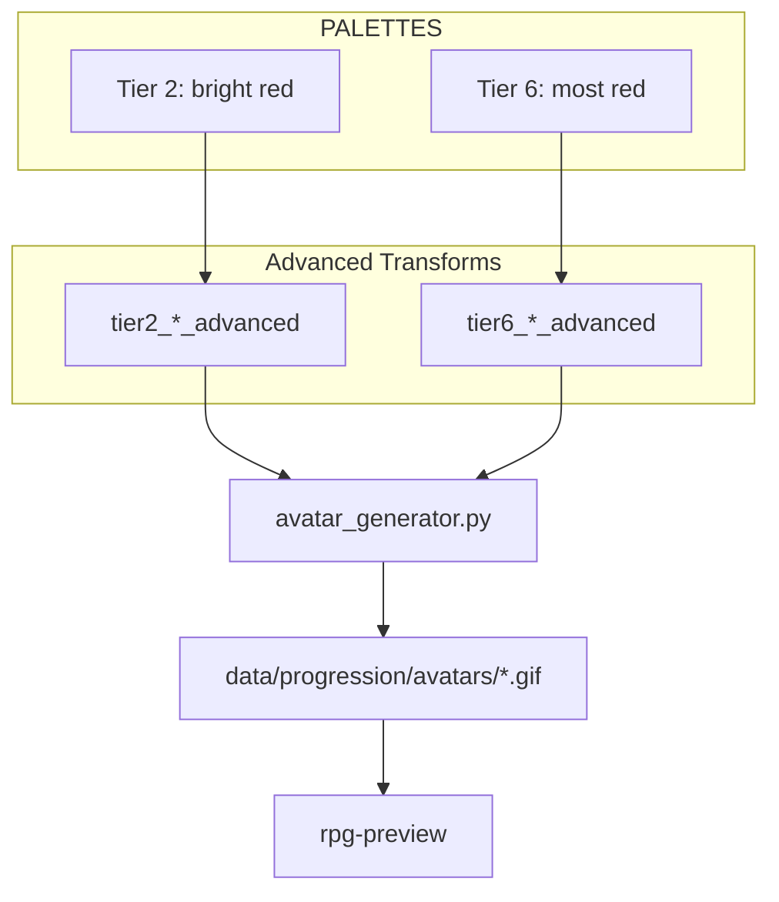

# Avatar Upgrades — Red Accents + Skill

Add red accents to upgraded avatars, differentiate early vs advanced, and create an Avatar Development skill.

---

## Execution Diagram

```
Time ──────────────────────────────────────────────────────────────────────>

Track A (sequential — transforms need accent first):
  [T1: Add accent palettes] ──────────>
                                    [T2: Update advanced transforms] ──>

Track B (parallel with A — different file):
  [T4: Create avatar-develop skill] ──────────>

Track C (sequential, after T2):
                                                      [T3: Optional tierColor] ──>
                                                                                  [T5: Regenerate + verify] ──>
```

**Summary:** T1 must finish before T2 (transforms reference PALETTES). T4 can run in parallel. T3 is optional and can run after T2. T5 runs last after all sprite changes are done.

---

## Task Assignments

### T1. Add "accent" Key to PALETTES

**File:** [scripts/rpg_sprites.py](scripts/rpg_sprites.py)

**What to do:**

- For each of the 6 entries in `PALETTES`, add an `"accent"` key with red hues:
  - Tier 1: `(180, 70, 70)` — muted red
  - Tier 2: `(220, 60, 60)` — bright red (user requested)
  - Tier 3: `(170, 65, 65)` — subtle red
  - Tier 4: `(200, 75, 50)` — warm red
  - Tier 5: `(190, 70, 80)` — subtle red
  - Tier 6: `(240, 80, 60)` — most red (Grand Master)

**Agent recommendation:** Fast model — six one-line additions to the PALETTES dict.

---

### T2. Update Advanced Transforms to Use Accent

**File:** [scripts/rpg_sprites.py](scripts/rpg_sprites.py)

**What to do:**

- In each of the 12 `tierN_*_advanced` functions, change the color used for NEW pixels (added via `add_pixels`) from `p["glow"]` / `p["highlight"]` to `p["accent"]` (or a mix using `brightness(p["accent"], n)`).
- Functions to update:
  - `tier1_idle_advanced`, `tier1_action_advanced`
  - `tier2_idle_advanced`, `tier2_action_advanced`
  - `tier3_idle_advanced`, `tier3_action_advanced`
  - `tier4_idle_advanced`, `tier4_action_advanced`
  - `tier5_idle_advanced`, `tier5_action_advanced`
  - `tier6_idle_advanced`, `tier6_action_advanced`

**Agent recommendation:** Sonnet — 12 functions, needs care to only change the extra particle/glow colors, not base sprite.

---

### T3. Optional — tierColor(tier, variant) for Badge

**Files:** [website/packages/shared/lib/rpg.ts](website/packages/shared/lib/rpg.ts), [website/packages/shared/components/AvatarBadge.tsx](website/packages/shared/components/AvatarBadge.tsx)

**What to do:**

- Extend `tierColor(tier: number, variant?: 'early' | 'advanced')` in rpg.ts. When `variant === 'advanced'`, return a slightly warmer/red-tinted version (e.g. `color-mix(in srgb, ${base}, #e06060 15%)` or precomputed hex).
- In AvatarBadge: compute `const isAdvanced = profile && isAdvancedVariant(profile.level, profile.avatar_tier)` and pass `tierColor(profile?.avatar_tier ?? 0, isAdvanced ? 'advanced' : 'early')`.

**Agent recommendation:** Fast model — function signature change and one prop.

---

### T4. Create Avatar Development Skill

**File:** `.cursor/skills/avatar-develop/SKILL.md` (new)

**What to do:**

- Create skill with frontmatter: `name: avatar-develop`, `description: Alter avatar sprites and animations; edit → generate → preview → approve. Use when /avatardev or "alter avatar".`
- Sections:
  1. **Command patterns:** `/avatardev`, `/avatardev <instruction>`, natural language
  2. **Architecture:** rpg_sprites.py (PALETTES, body parts, transforms, TIER_ANIMATIONS / TIER_ANIMATIONS_ADVANCED), avatar_generator.py (--tier, --variant), rpg-preview page, data/progression/avatars/
  3. **Editing patterns:** palette changes → PALETTES; new particles → tierN_*_advanced; body parts → _tierN_sprite(); reference brighten_part, add_pixels, brightness, pulse_color
  4. **Test-and-approve workflow:** Edit → `python3 scripts/avatar_generator.py --variant both` → `cd website && npm run dev` → open rpg-preview → screenshot/show → user approves or requests changes

**Agent recommendation:** Fast model — structured documentation from existing knowledge.

---

### T5. Regenerate Assets and Verify

**What to do:**

1. Run: `python3 scripts/avatar_generator.py --variant both`
2. Verify 36 files (18 early + 18 advanced) in `data/progression/avatars/`
3. Start dev server: `cd website && npm run dev`
4. Open `http://localhost:3000/rpg-preview` and confirm all tiers render with red accents on advanced variants

**Agent recommendation:** Fast model — run commands, visual check.

---

## Model/Agent Recommendations


| Task                           | Complexity | Model  | Why                                       |
| ------------------------------ | ---------- | ------ | ----------------------------------------- |
| T1: Add accent palettes        | Low        | Fast   | Six one-line edits                        |
| T2: Update advanced transforms | Medium     | Sonnet | 12 functions, must change only new pixels |
| T3: Optional tierColor         | Low        | Fast   | Function + prop wiring                    |
| T4: Create skill               | Low        | Fast   | Structured markdown                       |
| T5: Regenerate + verify        | Low        | Fast   | Commands + preview                        |


---

## Red Accent Flow




