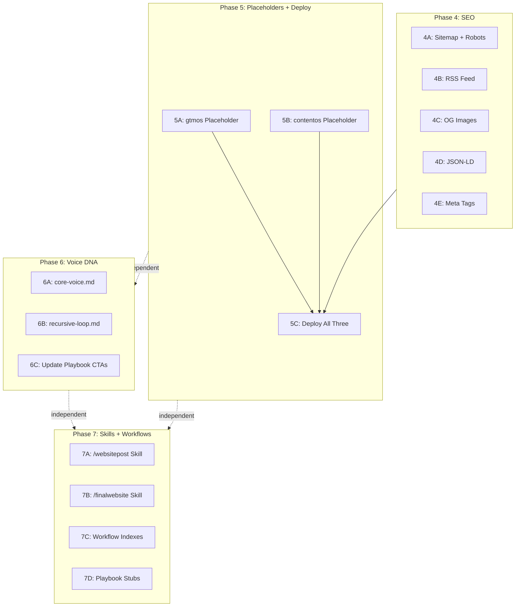

# Post-Build Launch Phases (4-7)

The shawnos.ai Next.js app is fully built. What remains: SEO hardening, two placeholder apps, deployment, voice system updates, and new Cursor skills/workflows.

## Current State

- **App**: `website/apps/shawnos/` -- 4 routes (`/`, `/about`, `/blog`, `/blog/[slug]`), all type-checked and built
- **Shared**: `website/packages/shared/` -- 5 components, blog engine, markdown pipeline, tokens.css
- **Content**: `content/website/final/hello-world.md` (1 test post)
- **Missing**: No SEO, no gtmos/contentos apps, no Vercel deployment, no website-specific skills
- **Constraint**: Turbo CLI crashes on macOS Tahoe -- use `npx next dev` / `npx next build` directly

---

## Phase 4 -- SEO (shawnos.ai production-readiness)

Single agent. All work in `website/apps/shawnos/`.

### 4A: Sitemap + Robots

- Install `next-sitemap` in [website/apps/shawnos/package.json](website/apps/shawnos/package.json) 
- Create `website/apps/shawnos/next-sitemap.config.js` with `siteUrl: 'https://shawnos.ai'`
- Add `"postbuild": "next-sitemap"` script

### 4B: RSS Feed

- Create `website/apps/shawnos/app/feed.xml/route.ts` -- route handler that calls `getAllPosts(CONTENT_DIR)` from [shared lib](website/packages/shared/lib/posts.ts) and returns XML with `Content-Type: application/xml`
- Same `CONTENT_DIR` pattern: `path.join(process.cwd(), '../../../content/website/final')`

### 4C: OG Image Generation

- Create `website/apps/shawnos/app/og/route.tsx` using `next/og` (`ImageResponse`)
- Terminal aesthetic: dark background, green accent, JetBrains Mono, site title
- Reference in layout metadata: `openGraph.images`

### 4D: JSON-LD Structured Data

- Add to [layout.tsx](website/apps/shawnos/app/layout.tsx): `<script type="application/ld+json">` with Person + WebSite schemas
- `sameAs` array includes: LinkedIn, X, Substack, GitHub, `https://thegtmos.ai`, `https://thecontentos.ai`
- Add Article schema to [blog/[slug]/page.tsx](website/apps/shawnos/app/blog/[slug]/page.tsx) via `generateMetadata()`

### 4E: Meta Tags + Canonical URLs

- Ensure `generateMetadata()` on every page returns `title`, `description`, `openGraph`, `twitter`, `alternates.canonical`
- Pages to update: [page.tsx](website/apps/shawnos/app/page.tsx) (landing), [about/page.tsx](website/apps/shawnos/app/about/page.tsx), [blog/page.tsx](website/apps/shawnos/app/blog/page.tsx), [blog/[slug]/page.tsx](website/apps/shawnos/app/blog/[slug]/page.tsx)

---

## Phase 5 -- Placeholder Apps + Deploy

Can be split into 3 parallel agents (5A, 5B independent; 5C after both).

### 5A: Scaffold gtmos Placeholder

Create `website/apps/gtmos/` -- minimal app:

- `package.json` (same structure as shawnos, name `@shawnos/gtmos`)
- `tsconfig.json`, `next.config.ts`, `postcss.config.mjs` (same patterns)
- `app/globals.css` -- same imports, override `--accent: #D2A53C` (amber from [tokens.css](website/packages/shared/styles/tokens.css))
- `app/layout.tsx` -- TerminalChrome + Navigation + NetworkBanner + Footer, title "thegtmos.ai"
- `app/page.tsx` -- "coming soon" page: tagline "the gtm operating system. launching soon.", link to shawnos.ai
- Run `npm install` from `website/` root after scaffold

### 5B: Scaffold contentos Placeholder

Same pattern as 5A for `website/apps/contentos/`:

- Override `--accent: #9B72CF` (purple from tokens.css)
- Title "thecontentos.ai"
- Tagline "the content operating system. launching soon."

### 5C: Deploy All Three to Vercel

**Pre-requisites (manual):** domains purchased, DNS configured, 3 Vercel projects created with correct `rootDirectory` values.

- Create `vercel.json` in each app dir with `relatedProjects` (project IDs from Vercel dashboard)
- Git commit + push to trigger auto-deploy
- Verify: shawnos.ai full site, thegtmos.ai placeholder, thecontentos.ai placeholder
- Verify NetworkBanner cross-links work, SEO endpoints (sitemap, RSS, OG) respond

---

## Phase 6 -- Recursive Awareness DNA

All voice/content-ops work. Single agent or 2 parallel agents (6A+6B together, 6C separate).

### 6A: Update core-voice.md

Edit [skills/tier-1-voice-dna/core-voice.md](skills/tier-1-voice-dna/core-voice.md) Voice Characteristics section (currently has 7 items ending at "No gatekeeping"):

- Add "Recursive awareness" entry after "Pattern articulation"
- Note in Priority Hierarchy that "Interesting" now includes recursive self-reference as a signature pattern

### 6B: Create recursive-loop.md

New file: `skills/tier-3-content-ops/recursive-loop.md`

- Name the concept + three layers (story / system / meta)
- Document 1-to-3 split framework: one experience -> shawnos.ai (personal) + thegtmos.ai (technical) + thecontentos.ai (methodology)
- Cross-reference patterns: how each post links to siblings
- Funnel direction: social -> blogs (three sites) -> Substack
- **Keyword Topology section** (added from SEO keyword topology plan):
  - "Building with AI" is the root concept all three sites branch from -- shawnos owns it as the hub, gtmos specializes it for GTM, contentos specializes it for content
  - Each site's content proves the other two sites' keyword authority (the recursive SEO loop)
  - The Figma/MVP angle for contentos: "design-to-content workflow" and "Figma MVP stories" are searchable niches that map to contentos's keyword territory
  - Cross-link strategy: contextual internal links between the three sites reinforce the keyword graph for Google
  - Reference `website/taxonomy.yaml` for the full keyword cluster map (primary, secondary, long-tail per domain)

### 6C: Update Playbook CTAs

4 files to edit -- add the blog layer to the funnel:

- [skills/tier-2-context-playbooks/linkedin.md](skills/tier-2-context-playbooks/linkedin.md) -- CTA Style section (lines ~112-126): add blog post CTAs alongside existing Substack CTAs
- [skills/tier-2-context-playbooks/x-twitter.md](skills/tier-2-context-playbooks/x-twitter.md) -- CTA Style section (lines ~95-108): thread endings now link to blog posts
- [skills/tier-3-content-ops/pillars/newsletter-growth.md](skills/tier-3-content-ops/pillars/newsletter-growth.md) -- Content-First Funnel (lines ~10-16): insert blogs as middle layer between social and Substack
- [skills/tier-3-content-ops/pillars/reddit-growth-seo.md](skills/tier-3-content-ops/pillars/reddit-growth-seo.md) -- reverse-funnel section (lines ~24-25): profile links point to blogs

---

## Phase 7 -- Cursor Skills + Workflow Indexes

All independent file creation. Single agent.

### 7A: /websitepost Skill

Create `.cursor/skills/website-post/SKILL.md` -- mirrors [substack-post SKILL.md](.cursor/skills/substack-post/SKILL.md) pattern:

- Triggered by `/websitepost`
- Drafts a blog post for shawnos.ai in `content/website/drafts/`
- Uses voice system, pillar detection, post numbering
- Outputs markdown with frontmatter (title, date, excerpt)

### 7B: /finalwebsite Skill

Create `.cursor/skills/final-website/SKILL.md` -- mirrors [final-substack SKILL.md](.cursor/skills/final-substack/SKILL.md) pattern:

- Triggered by `/finalwebsite`
- Moves draft from `content/website/drafts/` to `content/website/final/`
- Runs voice normalization pass
- Generates cross-promo snippets for LinkedIn + X

### 7C: Workflow Indexes

Create 3 files mirroring [workflows/substack-index.md](workflows/substack-index.md) structure:

- `workflows/website-index.md` -- shawnos.ai post tracking (active)
- `workflows/gtmos-index.md` -- thegtmos.ai post tracking (stub, "launching soon")
- `workflows/contentos-index.md` -- thecontentos.ai post tracking (stub, "launching soon")

### 7D: Platform Playbook Stubs

Create 3 files in `skills/tier-2-context-playbooks/`:

- `website.md` -- shawnos.ai voice/structure guide (terminal aesthetic, blog-first, build-in-public tone)
- `gtmos.md` -- stub ("to be filled when site goes active")
- `contentos.md` -- stub ("to be filled when site goes active")

---

## Parallelism Map

- **Phase 4 + Phase 5A/5B + Phase 6 + Phase 7** can all run in parallel (no file overlaps)
- **Phase 5C** (deploy) depends on Phase 4 (SEO) + Phase 5A/5B (placeholders) completing first
- Within Phase 4, all sub-tasks (4A-4E) touch different files and can be done by one agent sequentially

