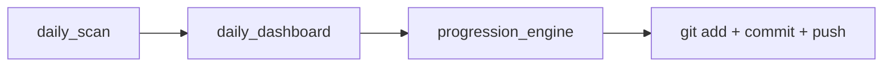

# Progression Cron + XP Receipts Plan

## Problem Summary

1. **Progression engine is not in the cron** — The cron runs `daily_scan.py` and `daily_dashboard.py`, but never runs `progression_engine.py`. So `profile.json` and avatar tier stay stale even when new daily logs are created.
2. **Receipts don't show "points away"** — The dashboard shows `1,882/2,000 XP` in the avatar panel, but there is no explicit "118 pts to Lv.10" or similar. The `/tracker` markdown summary and the website log view have no progression info at all.

---

## Part 1: Add Progression Engine to Cron

**File:** [scripts/daily_cron.sh](scripts/daily_cron.sh)

- Insert a new Step 2.5 after dashboard generation and before the commit step:
  - Run `progression_engine.py` (no date needed — it reads all daily-log JSONs)
  - Use `--skip-avatar` only if avatar generation is slow/problematic; otherwise run full so tier-2 avatar gets generated when you hit level 10
- Update the git staging to include progression outputs:
  - Currently: `$GIT add data/daily-log/*.json`
  - Add: `$GIT add data/progression/profile.json data/progression/avatars/`
- Update the commit message to reflect both scan + progression: e.g. `chore: daily tracker + progression $TARGET_DATE`

**Order of operations:**




---

## Part 2: Enrich Profile with "Points to Next"

**File:** [scripts/progression_engine.py](scripts/progression_engine.py)

Add to the profile dict in `build_profile()`:

- `xp_to_next`: `max(0, xp_next - total_xp)` — points needed to reach the next milestone
- `next_level`: level number of the next milestone (e.g. 10)
- `next_title`: title at that level (e.g. "Repo Architect")

These come from the same `TITLE_TABLE` lookup used for `xp_next_level`. At max level, set `xp_to_next: 0`, `next_level: null`, `next_title: null`.

---

## Part 3: Show "Points Away" on All Receipts

### 3a. Dashboard image

**File:** [scripts/daily_dashboard.py](scripts/daily_dashboard.py)

In the avatar/RPG block (around lines 356–381), when `rpg_profile` exists:

- Read `xp_to_next` from profile.
- If `xp_to_next > 0`: add a line below the XP bar, e.g. `"118 pts to Lv.10 · Repo Architect"` in `fSmall`, `MUTED`.
- If `xp_to_next == 0`: show `"Max level"` or similar.

### 3b. Daily-tracker skill markdown summary

**File:** [.cursor/skills/daily-tracker/SKILL.md](.cursor/skills/daily-tracker/SKILL.md)

Update the workflow so the agent:

- Reads `data/progression/profile.json` after generating the dashboard.
- Adds a **Progression** line to the Stats section, e.g.:
  - `- Progression: 1,882 XP · 118 pts to Lv.10 (Repo Architect)`
  - Or at max: `Progression: 2,594 XP · Max level`

### 3c. Website log view

**File:** [website/packages/shared/components/DailyLogView.tsx](website/packages/shared/components/DailyLogView.tsx)

The log view currently has no access to `profile.json`. Options:

- **A)** Fetch profile at the log page level and pass it as a prop to `DailyLogView`.
- **B)** Embed progression snapshot in the daily-log JSON during `daily_scan` or `daily_dashboard` (denormalization).
- **C)** Have the log page/layout fetch `profile.json` from a static path or API and render a small progression badge.

Recommendation: **C** — Log page (or parent layout) reads `profile.json` from the public/API surface and renders a compact progression line in the header or stats row: e.g. `1,882 XP · 118 pts to Lv.10`.

**File:** [website/packages/shared/lib/rpg.ts](website/packages/shared/lib/rpg.ts) or equivalent  

- Ensure the `RPGProfile` type includes `xp_to_next`, `next_level`, `next_title` for the UI.

---

## Part 4: Manual Test to Verify Activation

1. **Run progression engine now** (to catch up with existing logs):
  ```bash
   python3 scripts/progression_engine.py
  ```
  - Confirms you are at 2,594+ XP and tier 2 avatar.
  - Updates `profile.json` and avatar assets.
2. **Run the full cron script manually** (dry run for yesterday):
  ```bash
   ./scripts/daily_cron.sh $(date -v-1d +%Y-%m-%d)
  ```
  - Or pass a specific date: `./scripts/daily_cron.sh 2026-02-16`
  - Should run: scan → dashboard → progression → commit → push.
  - Inspect `cron.log` to confirm progression step ran.
3. **Regenerate today’s dashboard** to see the new "pts to next" line:
  ```bash
   python3 scripts/daily_dashboard.py
  ```
  - Open `data/daily-log/$(date +%Y-%m-%d).png` and verify the progression text.
4. **Run `/tracker**` to see the markdown summary with the new Progression line.

---

## Files to Modify


| File                                                              | Changes                                                                     |
| ----------------------------------------------------------------- | --------------------------------------------------------------------------- |
| `scripts/daily_cron.sh`                                           | Add progression_engine step, stage progression files, update commit message |
| `scripts/progression_engine.py`                                   | Add `xp_to_next`, `next_level`, `next_title` to profile output              |
| `scripts/daily_dashboard.py`                                      | Render "X pts to Lv.N · Title" (or "Max level") below XP bar                |
| `.cursor/skills/daily-tracker/SKILL.md`                           | Add instruction to read profile and include Progression in Stats            |
| `website/packages/shared/components/DailyLogView.tsx` or log page | Add progression badge using profile data                                    |
| `website/packages/shared/lib/rpg.ts`                              | Extend `RPGProfile` type with new fields                                    |


---

## Optional: Progression-Only Test Script

Add `scripts/run_progression_only.sh` that runs only `progression_engine.py` and reports the result, for quick checks without running the full cron. Useful for debugging and ad-hoc updates.