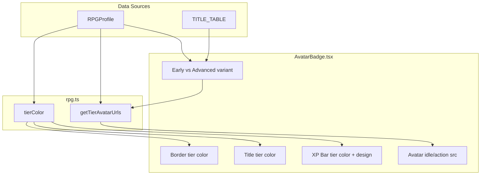

# RPG Sprite, Scoring, and UI — Full Plan

Single consolidated plan. All 9 tasks with full instructions.

---

## Execution Diagram

```
Time ──────────────────────────────────────────────────────────────────────────────────>

Wave 1 (parallel):
  [T1: Grade colors]     ──────────>
  [T2: Shrink avatar]    ──────────>
  [T5: Class system]    ──────────>
  [T6: JSON grades]     ──>

Wave 2 (sequential — same files):
                                        [T3: Thresholds] ──>
                                                           [T4: Weights] ──>

Wave 3 (parallel):
                                                                          [T8: Tier color] ──────────>
                                                                          [T7: Sprite variants] ─────>

Wave 4 (after T8):
                                                                                                    [T9: XP bar] ──>
```

**Summary:** T1, T2, T5, T6 can run in parallel (different files). T3 then T4 sequentially (both edit SKILL.md + 3 build-your-own pages). T7 and T8 in parallel. T9 after T8 (needs tierColor for XP bar fill).

---

## Architecture Overview



---

## Task Assignments

### T1. Fix gradeColor() for S/S+ Grades

**Files:** [website/packages/shared/components/DailyLogView.tsx](website/packages/shared/components/DailyLogView.tsx), [website/packages/shared/components/LogCard.tsx](website/packages/shared/components/LogCard.tsx)

**What to do:** Add S-tier handling at the top of `gradeColor()` in both files:

```typescript
function gradeColor(grade: string): string {
  if (grade === 'S+') return '#FF6B35'
  if (grade === 'S') return '#FFC83C'
  if (grade.startsWith('A')) return GREEN
  if (grade.startsWith('B')) return CYAN
  if (grade.startsWith('C')) return AMBER
  return RED
}
```

**Agent recommendation:** Fast model — simple function edit.

---

### T2. Shrink AvatarBadge + Add Next Level Display

**File:** [website/packages/shared/components/AvatarBadge.tsx](website/packages/shared/components/AvatarBadge.tsx)

**What to do:**
- Reduce compact SIZES: avatar 96→72, padding 16→12, font sizes ~2px smaller
- Add next-level display: `const nextTier = TITLE_TABLE.find(t => t.level > (profile?.level ?? 0))` and render `> next: {nextTier.title} (LVL {nextTier.level})` below XP bar in muted style

**Agent recommendation:** Fast model — size constants and one UI block.

---

### T3. Update Grade Thresholds

**Files:** [.cursor/skills/daily-tracker/SKILL.md](.cursor/skills/daily-tracker/SKILL.md), [website/apps/shawnos/app/log/build-your-own/page.tsx](website/apps/shawnos/app/log/build-your-own/page.tsx), [website/apps/gtmos/app/log/build-your-own/page.tsx](website/apps/gtmos/app/log/build-your-own/page.tsx), [website/apps/contentos/app/log/build-your-own/page.tsx](website/apps/contentos/app/log/build-your-own/page.tsx)

**What to do:** Replace grade table with: S+ >500, S 300-500, A+ 150-299, A 50-149, B 15-49, C 5-14, D <5. Update in SKILL.md and embedded prompt in all 3 build-your-own pages.

**Agent recommendation:** Fast model — find-and-replace in 4 files.

---

### T4. Update Point Weights

**Files:** Same as T3 (SKILL.md + 3 build-your-own/page.tsx)

**What to do:** Add weights: monorepo_build/project_scaffold 50, landing_page/full_page_build 25, feature_system 30, code_infra 15. Keep existing: *_final 10, manual 5, drafts 2. Update in SKILL.md and all 3 build-your-own pages.

**Agent recommendation:** Fast model — add to weights table in 4 files. Run after T3 (same files).

---

### T5. Clarify Class System

**File:** [website/packages/shared/pages/SkillGuidePage.tsx](website/packages/shared/pages/SkillGuidePage.tsx)

**What to do:** Update RPG_CLASSES and explanatory text: class = all-time output distribution, recalculated each scan, sustained output to shift, 1.5x XP multiplier on primary domain.

**Agent recommendation:** Fast model — copy edits.

---

### T6. Update JSON Grades (Optional)

**File:** [data/daily-log/2026-02-14.json](data/daily-log/2026-02-14.json)

**What to do:** Change grade from "A+" to "A" to match new thresholds (score 118 → A band).

**Agent recommendation:** Fast model — single field edit.

---

### T7. Sprite Variants (Early vs Advanced)

**Files:** [website/packages/shared/lib/rpg.ts](website/packages/shared/lib/rpg.ts), [website/packages/shared/components/AvatarBadge.tsx](website/packages/shared/components/AvatarBadge.tsx), [website/apps/shawnos/app/rpg-preview/page.tsx](website/apps/shawnos/app/rpg-preview/page.tsx)

**What to do:**
- Extend `getTierAvatarUrls(tier, variant?: 'early' | 'advanced')`: return `-advanced` asset URLs when variant is advanced; fallback to basic if missing
- In AvatarBadge: compute `isAdvanced` from TITLE_TABLE (current row = second in tier?); pass to getTierAvatarUrls
- In rpg-preview: render both early and advanced per tier

**Agent recommendation:** Sonnet — TITLE_TABLE lookup and variant logic.

---

### T8. Tier Color Hierarchy

**Files:** [website/packages/shared/lib/rpg.ts](website/packages/shared/lib/rpg.ts), [website/packages/shared/lib/index.ts](website/packages/shared/lib/index.ts), [website/packages/shared/components/AvatarBadge.tsx](website/packages/shared/components/AvatarBadge.tsx), [website/packages/shared/pages/SkillGuidePage.tsx](website/packages/shared/pages/SkillGuidePage.tsx)

**What to do:**
- Add `tierColor(tier: number): string` to rpg.ts (pick palette — Option B recommended: T1 slate, T2 emerald, T3 cyan, T4 amber, T5 violet, T6 gold)
- Export from shared lib index
- In AvatarBadge: use `tierColor(profile?.avatar_tier ?? 0)` for border, title text, XP bar fill (when profile exists)
- In SkillGuidePage: import `tierColor` from shared lib instead of local function

**Agent recommendation:** Fast model — straightforward refactor and style changes.

---

### T9. Cool XP Bar (after T8)

**File:** [website/packages/shared/components/AvatarBadge.tsx](website/packages/shared/components/AvatarBadge.tsx)

**What to do:**
- Replace `.avatar-badge-xp-track` and `.avatar-badge-xp-fill` with glow+gradient design:
  - Track: 6px height, rounded corners, dark background
  - Fill: `linear-gradient` from tier color to lighter 80%; optional soft `box-shadow` with tier color; optional 1px top highlight
  - Use `tierColor(profile?.avatar_tier ?? 0)` for fill (requires T8 done)

**Agent recommendation:** Fast model — CSS/styling only.

---

## Model/Agent Recommendations

| Task | Complexity | Model | Why |
|------|------------|-------|-----|
| T1: Grade colors | Low | Fast | Simple function edit |
| T2: Shrink avatar | Low | Fast | Size constants + one UI block |
| T3: Thresholds | Low | Fast | Find-and-replace |
| T4: Weights | Low | Fast | Add to table |
| T5: Class system | Low | Fast | Copy edits |
| T6: JSON grades | Low | Fast | One field |
| T7: Sprite variants | Medium | Sonnet | TITLE_TABLE lookup, variant logic |
| T8: Tier color | Low | Fast | Add function, swap color values |
| T9: XP bar | Low | Fast | CSS gradient and shadow |

No need for a heavyweight model. Largest file is AvatarBadge (~320 lines).

---

## Reference: Grade Thresholds (Task 3)

| Score | Grade |
|-------|-------|
| > 500 | S+ |
| 300–500 | S |
| 150–299 | A+ |
| 50–149 | A |
| 15–49 | B |
| 5–14 | C |
| < 5 | D |

---

## Reference: Point Weights (Task 4)

- monorepo_build / project_scaffold: 50
- landing_page / full_page_build: 25
- feature_system: 30
- code_infra: 15
- *_final: 10 | manual: 5 | drafts: 2

---

## Reference: Asset Naming (Task 7)

```
tier-{n}-idle.gif
tier-{n}-idle-advanced.gif
tier-{n}-action.gif
tier-{n}-action-advanced.gif
tier-{n}-static.png
```

Fallback: if `-advanced` missing, use basic for both.

---

## Reference: Color Palette Options

**Option A (current):** T1 gray, T2 accent, T3 cyan, T4 amber, T5 purple, T6 gold

**Option B (prestige ladder):** T1 `#64748B`, T2 `#10B981`, T3 `#06B6D4`, T4 `#F59E0B`, T5 `#8B5CF6`, T6 `#FBBF24`

**Option C (monochrome+gold):** T1–4 gray/accent shades, T5 `#A78BFA`, T6 `#FCD34D`
